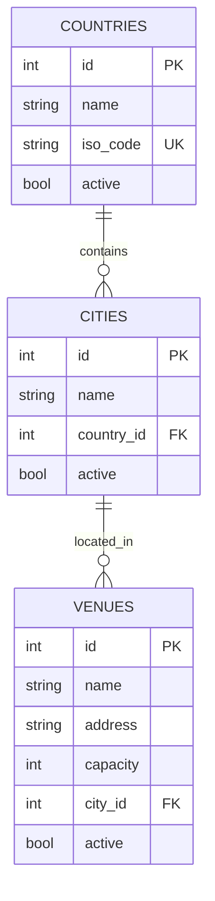
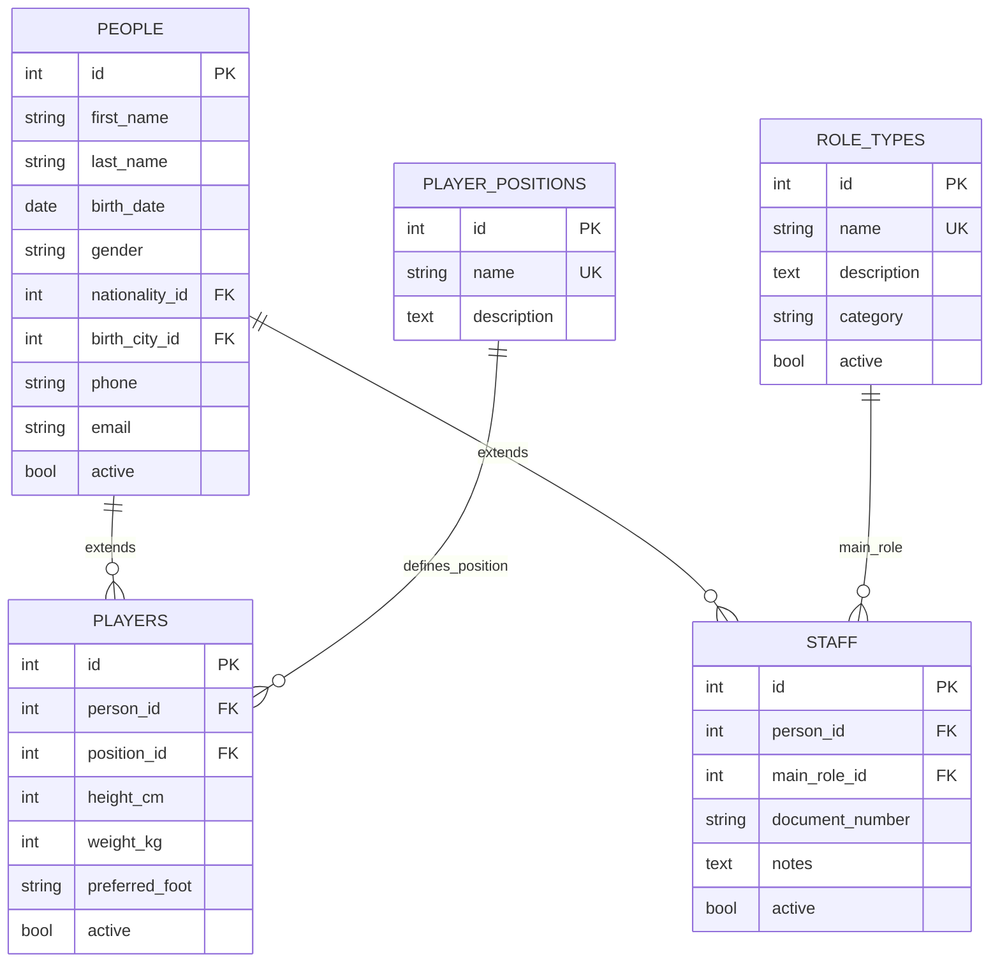
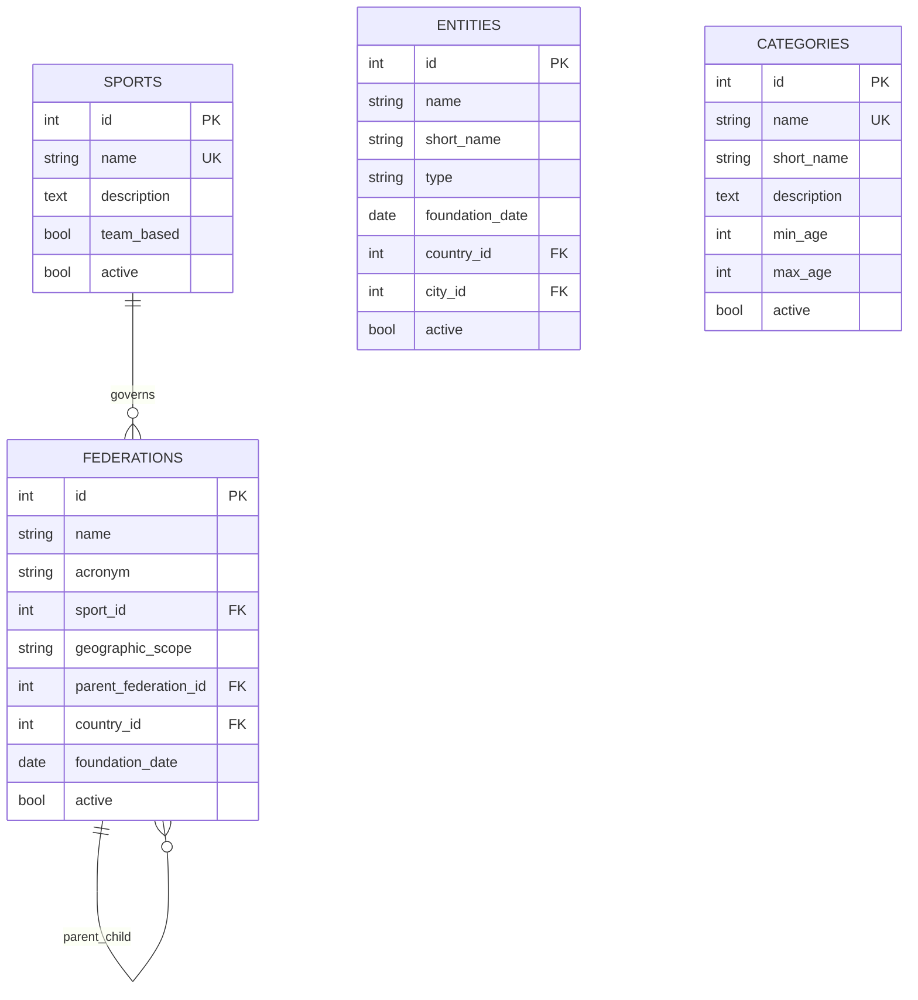
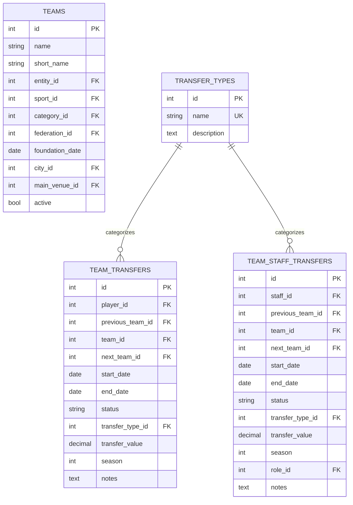
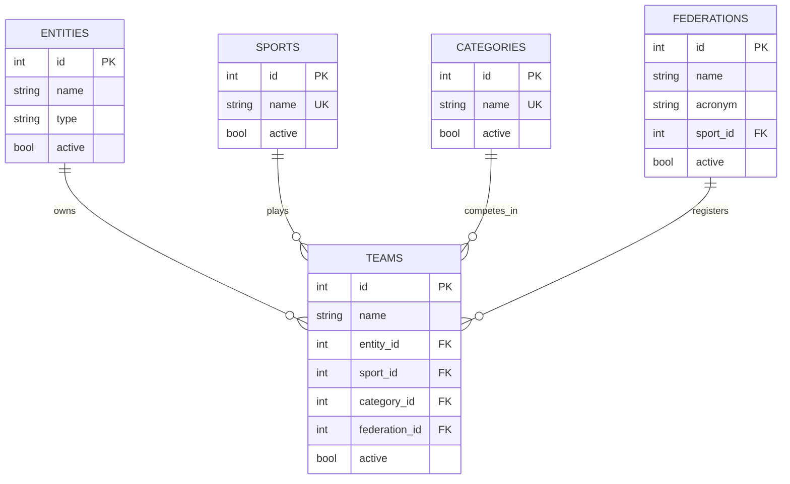
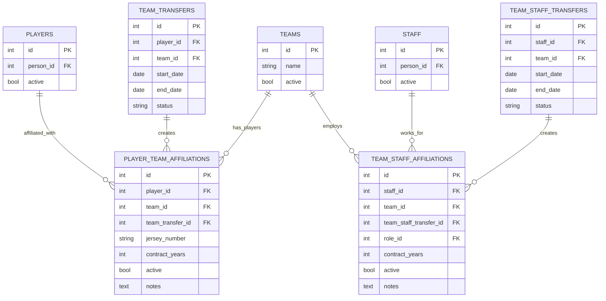
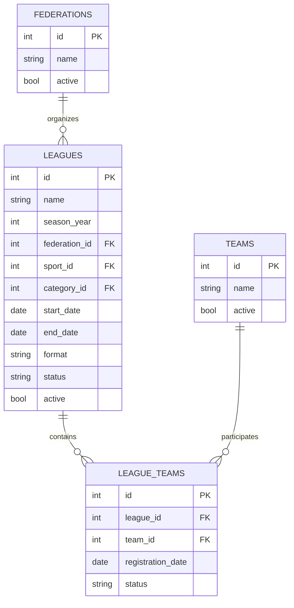
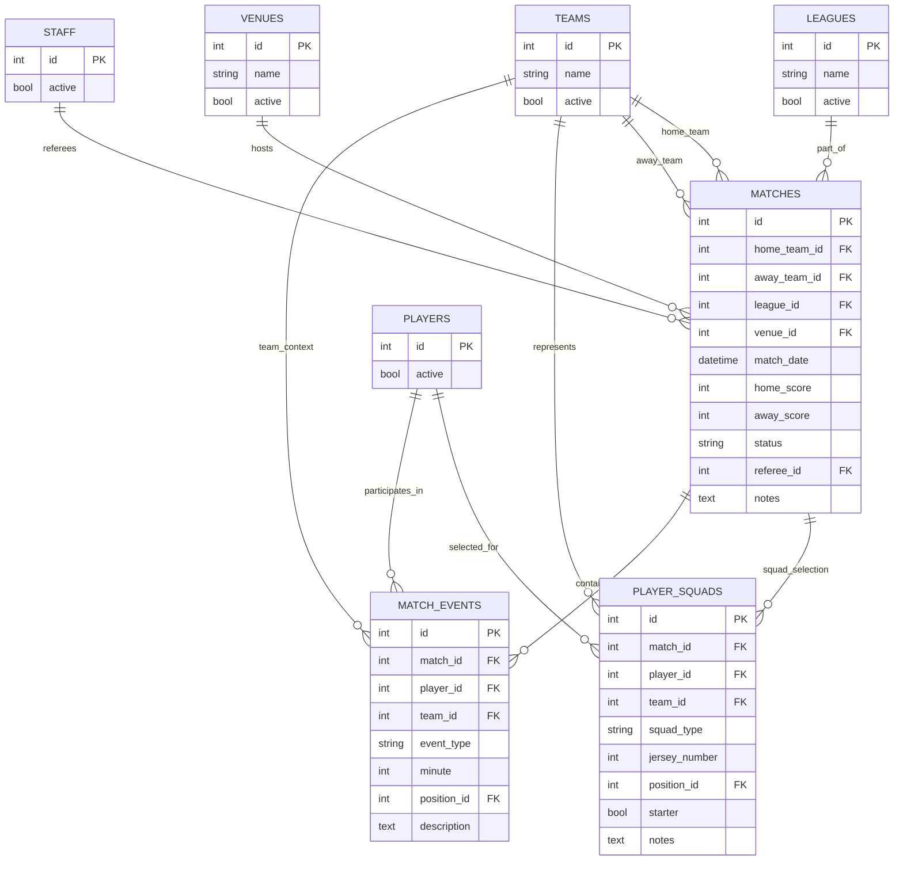
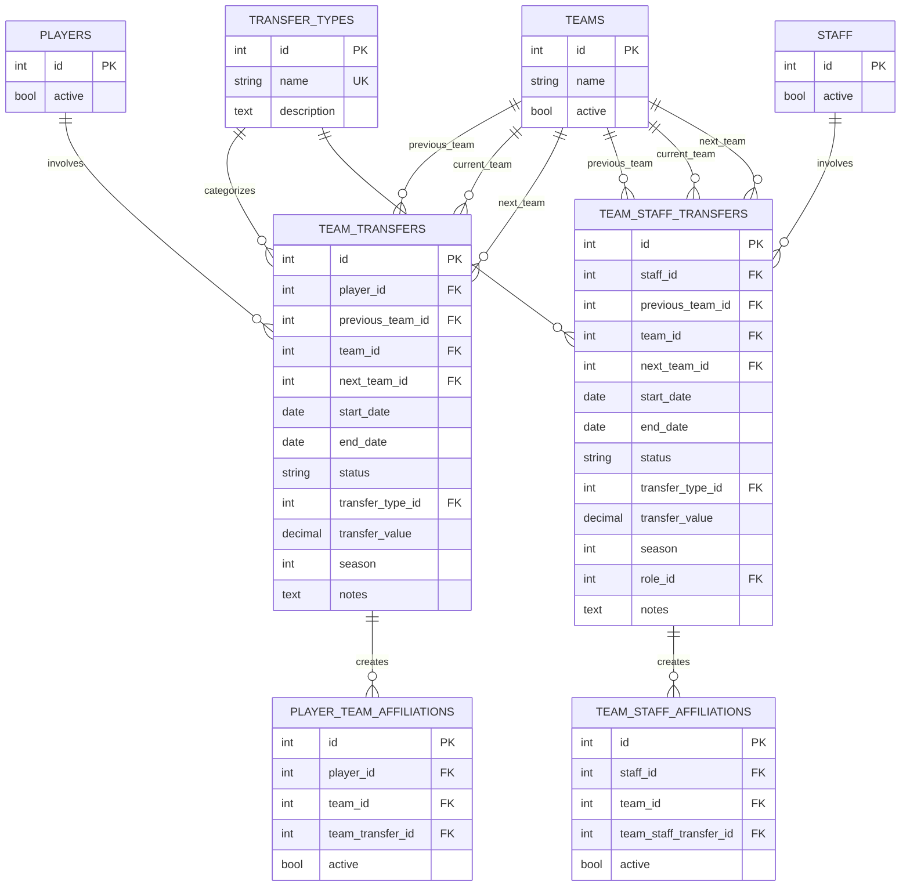

# SportifyAPI Database Schema

Este banco de dados implementa um sistema abrangente de gestão esportiva focado no futebol com relacionamentos adequados entre jogadores, equipes, organizações e federações.

## 🗺️ Localização e Geografia

## 👥 Pessoas e Funções

## 🏢 Organizações e Esportes

## ⚽ Equipes

## 🔗 Relacionamento: Organizações → Equipes

## 🤝 Relacionamento: Pessoas → Equipes

## 🏆 Competições e Ligas

## ⚽ Partidas e Eventos

## 🔄 Sistema de Transferências

