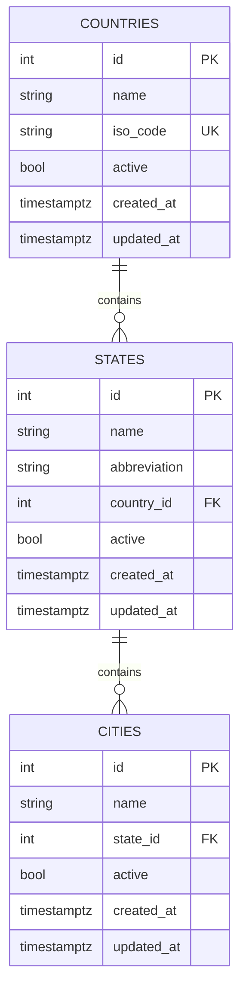
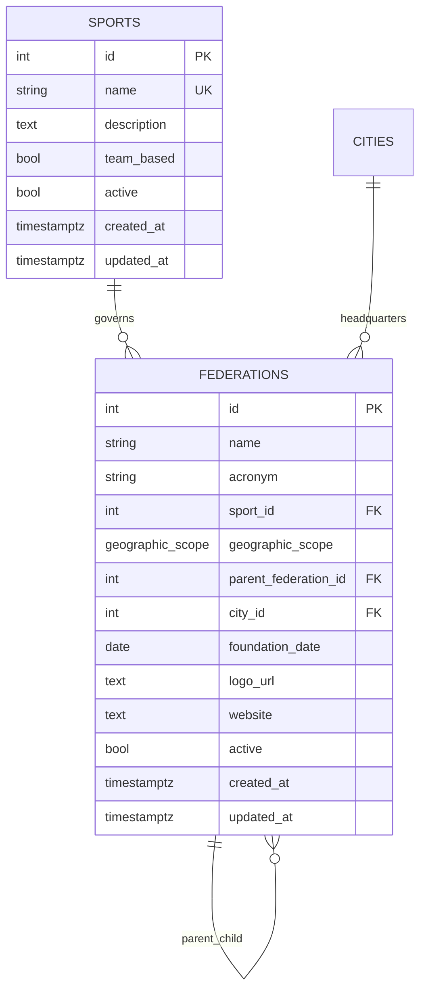
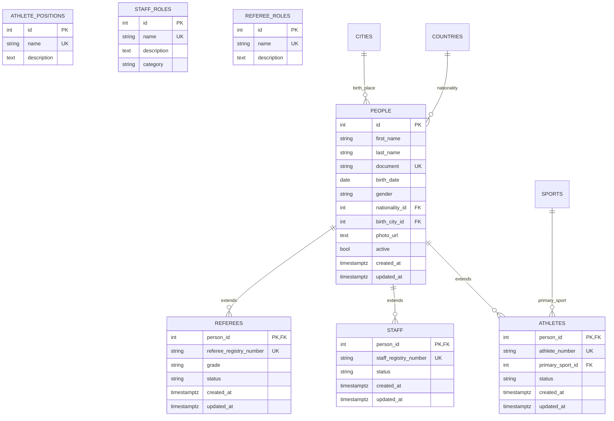

# SportifyAPI Database Schema

Este documento descreve o schema do banco de dados do SportifyAPI, focado em **Federações**, **Pessoas** e **Times**.

## 🗺️ Localização e Geografia



## 🏢 Esportes e Federações



**Geographic Scope Types:**
- `global` - Federação mundial (ex: FIFA)
- `continental` - Federação continental (ex: CONMEBOL)
- `national` - Federação nacional (ex: CBF)
- `regional` - Federação regional
- `state` - Federação estadual (ex: FPF)
- `local` - Federação local/municipal

## 👥 Pessoas e Funções



**Status Types:**
- Athletes: `active`, `free_agent`, `suspended`, `retired`
- Staff: `active`, `available`, `suspended`, `retired`
- Referees: `active`, `available`, `suspended`, `retired`

**Staff Categories:**
- `technical` - Técnico, preparador físico
- `medical` - Médico, fisioterapeuta
- `management` - Diretor, gerente
- `administrative` - Presidente, secretário

## ⚽ Times e Relacionamentos

```mermaid
erDiagram
    CLUBS {
        int id PK
        string name
        string short_name
        string acronym
        int federation_id FK
        int city_id FK
        date foundation_date
        text crest_url
        text website
        bool active
        timestamptz created_at
        timestamptz updated_at
    }
    
    CLUB_ATHLETE_ASSIGNMENTS {
        int club_id FK
        int athlete_id FK
        date start_date
        int position_id FK
        int shirt_number
        string status
        date end_date
        text notes
        timestamptz created_at
        timestamptz updated_at
        PRIMARY KEY (club_id, athlete_id, start_date)
    }
    
    CLUB_STAFF_ASSIGNMENTS {
        int club_id FK
        int staff_id FK
        date start_date
        int role_id FK
        string status
        date end_date
        text notes
        timestamptz created_at
        timestamptz updated_at
        PRIMARY KEY (club_id, staff_id, start_date)
    }
    
    FEDERATION_STAFF_ASSIGNMENTS {
        int federation_id FK
        int staff_id FK
        date start_date
        int role_id FK
        string status
        date end_date
        text notes
        timestamptz created_at
        timestamptz updated_at
        PRIMARY KEY (federation_id, staff_id, start_date)
    }
    
    FEDERATIONS ||--o{ CLUBS : registers
    CITIES ||--o{ CLUBS : headquarters
    CLUBS ||--o{ CLUB_ATHLETE_ASSIGNMENTS : employs
    ATHLETES ||--o{ CLUB_ATHLETE_ASSIGNMENTS : plays_for
    CLUBS ||--o{ CLUB_STAFF_ASSIGNMENTS : employs
    STAFF ||--o{ CLUB_STAFF_ASSIGNMENTS : works_for
    FEDERATIONS ||--o{ FEDERATION_STAFF_ASSIGNMENTS : employs
    STAFF ||--o{ FEDERATION_STAFF_ASSIGNMENTS : works_for
    ATHLETE_POSITIONS ||--o{ CLUB_ATHLETE_ASSIGNMENTS : position
    STAFF_ROLES ||--o{ CLUB_STAFF_ASSIGNMENTS : role
    STAFF_ROLES ||--o{ FEDERATION_STAFF_ASSIGNMENTS : role
```

**Assignment Status Types:**
- Club Athletes: `active`, `inactive`, `loaned`, `suspended`
- Club/Federation Staff: `active`, `inactive`, `suspended`

## 🏷️ Tags de Capacidades

```mermaid
erDiagram
    ATHLETE_POSITION_TAGS {
        int athlete_id FK
        int position_id FK
        PRIMARY KEY (athlete_id, position_id)
    }
    
    STAFF_ROLE_TAGS {
        int staff_id FK
        int role_id FK
        PRIMARY KEY (staff_id, role_id)
    }
    
    REFEREE_ROLE_TAGS {
        int referee_id FK
        int role_id FK
        PRIMARY KEY (referee_id, role_id)
    }
    
    ATHLETES ||--o{ ATHLETE_POSITION_TAGS : can_play
    ATHLETE_POSITIONS ||--o{ ATHLETE_POSITION_TAGS : position
    STAFF ||--o{ STAFF_ROLE_TAGS : capable_of
    STAFF_ROLES ||--o{ STAFF_ROLE_TAGS : role
    REFEREES ||--o{ REFEREE_ROLE_TAGS : capable_of
    REFEREE_ROLES ||--o{ REFEREE_ROLE_TAGS : role
```

## 📁 Estrutura de Arquivos

```
scripts/sql/creation_database/
├── 001_federations.sql    # Países, estados, cidades, esportes, federações
├── 002_people.sql         # Pessoas, atletas, árbitros, staff, funções
├── 003_teams.sql          # Clubes e relacionamentos
├── 004_sample_data.sql    # Dados de exemplo
├── validate_db.sql        # Queries de validação do banco
└── README.md             # Esta documentação
```

> **Nota**: Os arquivos SQL são executados automaticamente pelo PostgreSQL em ordem alfabética quando o container é iniciado.

## 🚀 Como Usar

### 1. Executar Database Setup
```bash
# Via Docker Compose
docker-compose up -d postgres

# Os arquivos SQL são executados automaticamente na ordem correta
```

### 2. Verificar Instalação
```sql
-- Verificar federações
SELECT f.name, f.acronym, s.name as sport, f.geographic_scope 
FROM federations f 
JOIN sports s ON f.sport_id = s.id;

-- Verificar clubes
SELECT c.name, c.acronym, f.acronym as federation, ci.name as city
FROM clubs c 
JOIN federations f ON c.federation_id = f.id
LEFT JOIN cities ci ON c.city_id = ci.id;

-- Verificar atletas ativos em clubes
SELECT p.first_name, p.last_name, c.name as club, pos.name as position, caa.shirt_number
FROM people p
JOIN athletes a ON p.id = a.person_id
JOIN club_athlete_assignments caa ON a.person_id = caa.athlete_id
JOIN clubs c ON caa.club_id = c.id
LEFT JOIN athlete_positions pos ON caa.position_id = pos.id
WHERE caa.end_date IS NULL AND caa.status = 'active';
```

### 3. Validação Completa
```bash
# Execute o arquivo de validação para verificar integridade
docker-compose exec postgres psql -U sportifyapi -d sportifyapi -f /docker-entrypoint-initdb.d/validate_db.sql
```

## 🔄 Atualizações Futuras

Este schema é a base simplificada focando apenas em:
- ✅ **Federações** - Estrutura organizacional do esporte
- ✅ **Pessoas** - Atletas, staff, árbitros
- ✅ **Times** - Clubes e relacionamentos

Próximas expansões planejadas:
- 🔮 **Competições** - Ligas, torneios, campeonatos
- 🔮 **Partidas** - Jogos, eventos, resultados
- 🔮 **Transferências** - Histórico de transferências
- 🔮 **Estatísticas** - Performance e métricas

## ⚙️ Triggers e Funções

Todas as tabelas possuem:
- **created_at**: Timestamp automático na criação
- **updated_at**: Timestamp automático na atualização (via trigger)
- **Validações**: Constraints para garantir integridade dos dados
- **Índices**: Otimizações para consultas frequentes